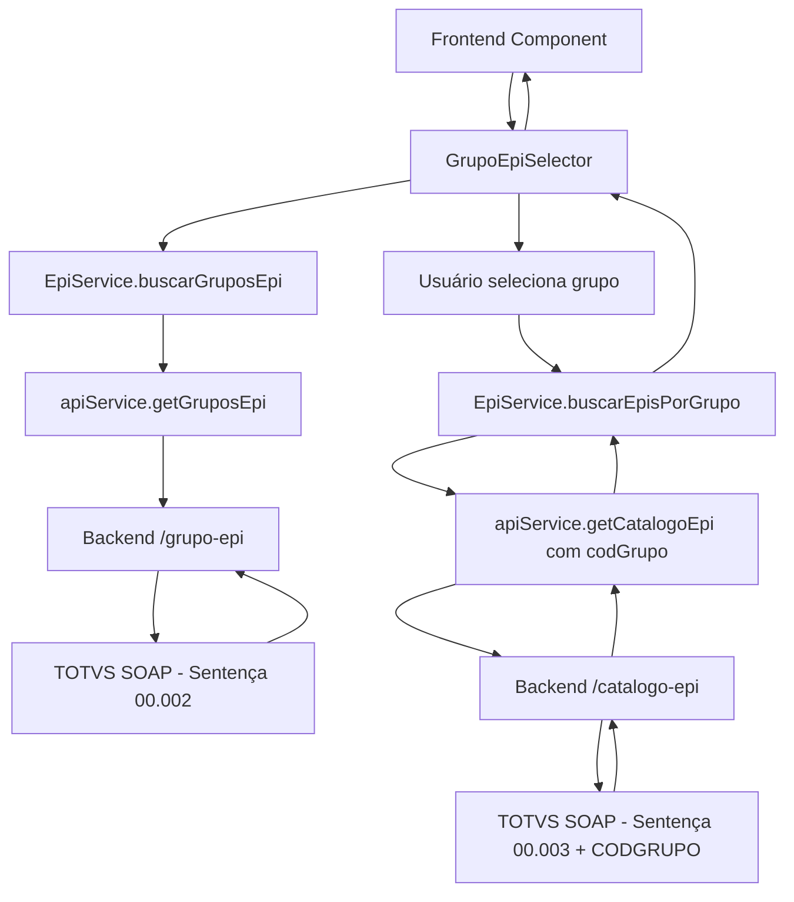

# Integração API SOAP - Sistema EPI

Este documento explica como foi implementada a integração entre o frontend Next.js e a API SOAP backend para o sistema de gestão de EPIs.

## 📋 Visão Geral

A integração permite que o frontend consuma dados reais do sistema TOTVS via API SOAP, substituindo os dados mock anteriormente utilizados.

### Endpoints Integrados

- **Colaboradores**: `/colaboradores` - Busca todos os funcionários
- **Grupos EPI**: `/grupo-epi` - Busca todos os grupos de EPIs
- **Catálogo EPI**: `/catalogo-epi` - Busca todos os itens de EPI (com filtro por grupo)
- **Consulta Genérica**: `/consulta` - Permite consultas SQL personalizadas

## 🚀 Como Executar

### 1. Iniciar a API Backend

```bash
cd BACKEND-API-main
npm install
npm start
```

A API será executada em: `http://localhost:3001`

### 2. Iniciar o Frontend

```bash
npm install
npm run dev
```

O frontend será executado em: `http://localhost:3000`

### 3. Testar a Integração

Acesse: `http://localhost:3000/test-api` para testar os endpoints.

## 🔧 Estrutura da Integração

### 1. API Service (`src/lib/api.ts`)

Serviço principal que gerencia as chamadas para a API SOAP:

```typescript
// Exemplos de uso
const colaboradores = await apiService.getColaboradores();
const gruposEpi = await apiService.getGruposEpi();
const catalogoEpi = await apiService.getCatalogoEpi('001'); // Filtrar por grupo
```

### 2. Serviços Específicos

#### FuncionarioService (`src/services/funcionario-service.ts`)
- `buscarFuncionarios()` - Busca funcionários (formato Funcionario)
- `buscarEmployees()` - Busca funcionários (formato Employee para wizard)
- `buscarFuncionarioPorChapa()` - Busca funcionário específico

#### EpiService (`src/services/epi-service.ts`)
- `buscarGruposEpi()` - Busca grupos EPI disponíveis
- `buscarCatalogoEpi()` - Busca catálogo completo ou filtrado por grupo
- `buscarEpisPorGrupo()` - Busca EPIs de um grupo específico
- `buscarEpiPorCodigo()` - Busca EPI específico
- `buscarEpisDisponiveis()` - Busca EPIs disponíveis
- `buscarGrupoPorCodigo()` - Busca grupo específico por código

### 3. Tipos TypeScript (`src/types/epi.ts`)

Tipos para dados da API SOAP e funções de conversão:

```typescript
// Tipos SOAP (dados brutos da API)
interface ColaboradorSOAP {
    CHAPA: string;
    NOME: string;
    CODFUNCAO: string;
    CODSECAO: string;
}

interface GrupoEpiSOAP {
    CODGRUPOEPI: string;
    NOME: string;
    DESCRICAO?: string;
}

interface EpiItemSOAP {
    CODIGO: string;
    NOME: string;
    CA?: string;
    GRUPO?: string;
    ATIVO?: boolean;
}

// Tipos Frontend (dados convertidos)
interface Employee {
    id: string;
    matricula: string;
    nome: string;
    codigoFuncao: string;
    codigoSecao: string;
}

// Funções de conversão
convertColaboradorSOAP(colaboradorSOAP: ColaboradorSOAP): Employee
convertEpiItemSOAP(epiSOAP: EpiItemSOAP): EpiItem
```

### 4. Componente GrupoEpiSelector (`src/components/GrupoEpiSelector.tsx`)

Componente React reutilizável para seleção de grupos EPI:

```typescript
// Uso do componente
<GrupoEpiSelector 
    onEpiSelected={(epis) => {
        console.log('EPIs selecionados:', epis);
    }}
/>
```

**Funcionalidades:**
- ✅ Carrega grupos EPI automaticamente
- ✅ Permite seleção de grupo via dropdown
- ✅ Busca EPIs do grupo selecionado
- ✅ Estados de loading e tratamento de erro
- ✅ Callback para componente pai
- ✅ Fallback para dados mock

## 📱 Componentes Atualizados

### 1. Seleção de Funcionários (`src/components/steps/employee-selection.tsx`)
- ✅ Carrega dados reais via `FuncionarioService.buscarEmployees()`
- ✅ Implementa loading state e tratamento de erro
- ✅ Mantém fallback para dados mock em caso de erro

### 2. Seleção de Lote/EPIs (`src/components/steps/batch-selection.tsx`)
- ✅ Carrega catálogo real via `EpiService.buscarCatalogoEpi()`
- ✅ Implementa filtros por código e grupo
- ✅ Mostra disponibilidade de estoque
- ✅ Mantém fallback para dados mock em caso de erro

### 3. ✨ Novo: Página de Teste (`src/app/test-api/page.tsx`)
- ✅ Interface completa para testar todos os endpoints
- ✅ Componente integrado GrupoEpiSelector
- ✅ Organização em abas (Testes Básicos, Seletor Grupo EPI, Resultados)
- ✅ Logs detalhados e tratamento de erros

## 🔄 Fluxo de Dados - Grupos EPI



## ⚙️ Configurações

### Variáveis de Ambiente

Crie um arquivo `.env.local` na raiz do projeto:

```env
# URL da API SOAP Backend
NEXT_PUBLIC_SOAP_API_URL=http://localhost:3001

# URL da API principal (se diferente)
NEXT_PUBLIC_API_URL=http://localhost:3001/api/v1
```

### Configuração da API Backend

A API backend está configurada em `BACKEND-API-main/script.js` com:

- **Servidor SOAP**: `https://orlandohenrique182744.rm.cloudtotvs.com.br:8051`
- **Credenciais**: username: `4dash`, password: `4dash`
- **CORS**: Habilitado para desenvolvimento
- **SSL**: Ignorando certificados inválidos (apenas dev)

#### Sentença SQL Configuradas

| Endpoint | Sentença | Parâmetros | Descrição |
|----------|----------|------------|-----------|
| `/colaboradores` | 00.004 | COLIGADA=1 | Lista funcionários |
| `/grupo-epi` | 00.002 | COLIGADA=1 | Lista grupos EPI |
| `/catalogo-epi` | 00.003 | COLIGADA=1; CODGRUPO=XXX | Lista EPIs (filtrado por grupo) |

## 🛠️ Tratamento de Erros

### Estratégia de Fallback

1. **Primeiro**: Tenta carregar dados da API SOAP
2. **Erro de conexão**: Mostra notificação e usa dados mock
3. **Dados vazios**: Mostra aviso mas continua funcionando
4. **Loading states**: Indicadores visuais durante carregamento

### Logs e Debug

Todos os serviços incluem logs detalhados:

```javascript
console.log('🔍 Buscando funcionários via API SOAP...');
console.log('📦 Buscando grupos EPI via API SOAP...');
console.log('🛡️ Buscando catálogo EPI via API SOAP...', { codGrupo });
console.log('✅ 25 funcionários carregados com sucesso');
console.error('❌ Erro ao carregar funcionários:', error);
```

## 🎯 Funcionalidades Implementadas

### ✅ Integração Básica
- [x] Busca de colaboradores
- [x] Busca de catálogo EPI
- [x] Conversão de tipos SOAP para TypeScript
- [x] Tratamento de erros com fallback
- [x] Loading states em todos os componentes

### ✅ Grupos EPI (Novo)
- [x] Busca de grupos EPI disponíveis
- [x] Seleção de grupo via interface
- [x] Busca filtrada de EPIs por grupo
- [x] Componente reutilizável GrupoEpiSelector
- [x] Página de teste completa

### ✅ Backend Preparado
- [x] Endpoint `/grupo-epi` funcional
- [x] Endpoint `/catalogo-epi` aceita parâmetros dinâmicos
- [x] Parse XML para JSON nos grupos
- [x] Logs detalhados em todos os endpoints

## 📝 Próximos Passos

### Melhorias Sugeridas

1. **Cache**: Implementar cache local para grupos EPI
2. **Paginação**: Adicionar paginação para grandes catálogos
3. **Filtros Avançados**: Mais filtros no componente GrupoEpiSelector
4. **Validação**: Validação mais robusta dos dados SOAP
5. **Performance**: Otimizar conversões e filtros
6. **Testes**: Adicionar testes unitários para novos componentes

### Endpoints Adicionais

- **Histórico de Empréstimos**: Consultas de EPIs emprestados por funcionário
- **Relatórios**: Endpoints para geração de relatórios por grupo
- **Validações**: Endpoints para validar operações antes da execução
- **Stock**: Endpoint para consulta de estoque por grupo/item

## 🚨 Troubleshooting

### Problemas Comuns

1. **"Failed to fetch"**
   - Verificar se a API backend está rodando
   - Verificar CORS na API
   - Verificar URL de conexão

2. **"Nenhum grupo EPI encontrado"**
   - Verificar credenciais SOAP
   - Verificar sentença SQL 00.002
   - Verificar logs da API backend

3. **"EPIs não carregam após selecionar grupo"**
   - Verificar se o CODGRUPO está sendo enviado corretamente
   - Verificar sentença SQL 00.003
   - Verificar logs no console e backend

4. **Dados não aparecem no frontend**
   - Verificar console do navegador
   - Verificar conversão de tipos
   - Verificar se os campos estão sendo mapeados corretamente

### Debug

Para debugar problemas:

1. Abrir DevTools do navegador (F12)
2. Ir para aba Console
3. Verificar logs das operações (🔍, 📦, 🛡️, ✅, ❌)
4. Ir para aba Network para verificar requisições HTTP
5. Usar a página `/test-api` para testes isolados
6. Verificar logs do backend no terminal

### Debug do Componente GrupoEpiSelector

```typescript
// Logs específicos do componente
console.log('🛡️ Carregando grupos EPI...');
console.log('🔍 Buscando EPIs do grupo:', grupoSelecionado);
console.log('✅ X EPIs encontrados para o grupo Y');
console.log('❌ Erro ao carregar grupos EPI:', error);
```

## 📞 Suporte

Para problemas ou dúvidas sobre a integração:

1. Verificar logs no console do navegador
2. Verificar logs da API backend
3. Usar a página de teste `/test-api`
4. Testar componente GrupoEpiSelector isoladamente
5. Verificar este documento para troubleshooting

## 🎉 Demonstração

### Fluxo Completo de Uso

1. **Acessar** `/test-api`
2. **Navegar** para aba "Seletor Grupo EPI"
3. **Aguardar** carregamento dos grupos
4. **Selecionar** um grupo no dropdown
5. **Clicar** em "Buscar EPIs do Grupo"
6. **Visualizar** EPIs específicos do grupo
7. **Verificar** logs no console

### Resultado Esperado

- ✅ Grupos EPI carregados do TOTVS
- ✅ Seleção funcional no dropdown
- ✅ EPIs filtrados por grupo
- ✅ Interface responsiva e amigável
- ✅ Tratamento de erros robusto

---

**Última atualização**: Janeiro 2025  
**Status**: ✅ Funcional com integração completa de grupos EPI  
**Versão**: 2.0 - Grupos EPI Integrados 